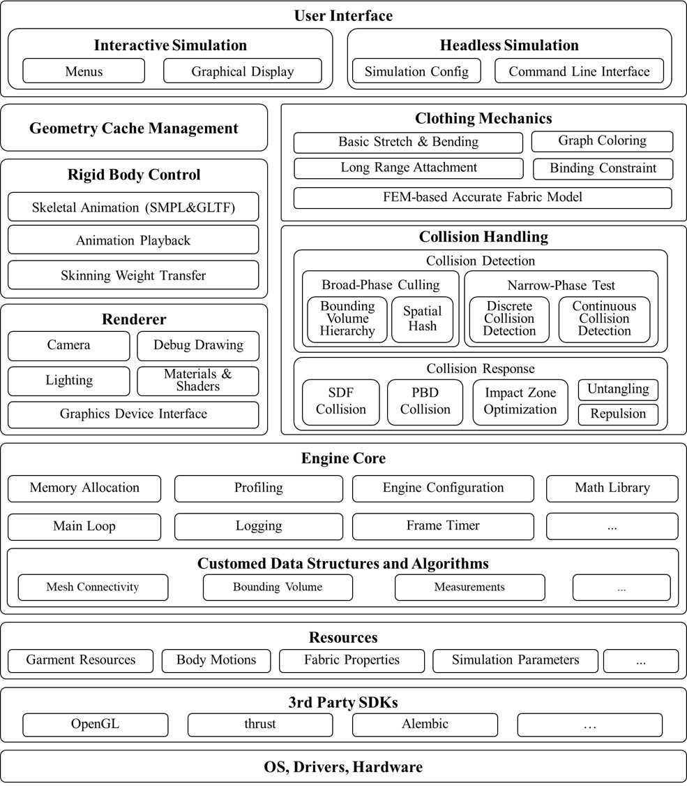

# Overview

- [Features](md-features)
- [Architecture](md-architecture)

*XRTailor* is a GPU-accelerated cloth simulation engine optimized for large-scale data generation. By leveraging parallel computing techniques, 
*XRTailor* delivers high-fidelity cloth dynamics while maintaining performance, making it a practical choice for applications in animation, gaming and machine learning dataset synthesis.

(md-features)=

## Features

- *Realistic Cloth Mechanics*. *XRTailor* models the physical behavior of fabrics, incorporating key mechanical properties such as stretch, bending, and anisotropy to provide plausible cloth deformation.

  <video style="width: 60%; max-width: 100%;" controls>
    <source src="https://github.com/user-attachments/assets/2fe3a8e1-cc01-4ba4-80c6-c00f4cb839cb" type="video/mp4">
  </video>

- *Collisions*. Collision detection and response are essential for cloth simulation. *XRTailor* supports obstacle-cloth collision, environment-cloth collision and self-collision. These features help maintain natural interactions between cloth and surrounding objects.

- *Fully Parallelized*. To achieve better performance, *XRTailor* employs advanced data structures and algorithms specifically designed for GPU execution. By maximizing parallelism, the engine supports rapid computation, making it suitable for real-time and offline simulations alike.

- *Balanced Performance Modes*. *XRTailor* offers two modes to accommodate different needs:

    - ***Swift Mode***: Optimized for real-time applications, offering rapid simulations with simplified fabric properties and collision handling.

    - ***Quality Mode***: Prioritizes accuracy, delivering highly detailed simulations at the cost of increased computational overhead.

  <video style="width: 60%; max-width: 100%;" controls>
    <source src="https://github.com/user-attachments/assets/0e3d986e-1bdc-40fb-b916-ce52afdbb930" type="video/mp4">
  </video>

- *Fully Automatic*. Unlike existing cloth simulators, animators do not need to place the cloth pieces in appropriate positions to dress an avatar.

- *Highly Compatible with SMPL(X)*. *XRTailor* supports SMPL, SMPLH, SMPLX with AMASS integration.

  <video style="width: 60%; max-width: 100%;" controls>
    <source src="https://github.com/user-attachments/assets/faffb237-c3f3-4f09-bf2f-47ff7c1bec0a" type="video/mp4">
  </video>

- *GLTF Support*. Allows importing mannequins with skeletal animation in GLTF format.

  <video style="width: 60%; max-width: 100%;" controls>
    <source src="https://github.com/user-attachments/assets/015f36c9-1bc6-4344-ac95-d6ad7975276b" type="video/mp4">
  </video>

- *Easy to Use*. Traditional cloth simulation workflow is laborious and knowledge intensive. *XRTailor* aims to simplify the process, allowing users to obtain desired outputs (such as Alembic or OBJ sequences) using a single command.

  <video style="width: 60%; max-width: 100%;" controls>
    <source src="https://github.com/user-attachments/assets/18fc1805-1b8d-4ebf-985d-1a53ac45747a" type="video/mp4">
  </video>

- Simulation as a Service. *XRTailor* is a powerful and scalable platform designed for large-scale data generation. Our simulation service enables users to efficiently create and manage vast amounts of synthetic data. Designed for large-scale synthetic data generation, *XRTailor* can be deployed via Docker, even in headless environments.

  <video style="width: 60%; max-width: 100%;" controls>
    <source src="https://github.com/user-attachments/assets/051c0946-dcb9-4151-8e60-b03d13a599b9" type="video/mp4">
  </video>

- *Multi Platform Support*. *XRTailor* runs on Windows and Linux systems that support CUDA, offering flexibility across computing environments.

- *OpenGL Rendering*. A built-in graphical interface provides visualization and control over the simulation process.

  <video style="width: 60%; max-width: 100%;" controls>
    <source src="https://github.com/user-attachments/assets/bb9dd20a-720f-468e-9ee1-2edb0d3937d7" type="video/mp4">
  </video>

(md-architecture)=

## Architecture

The architecture of *XRTailor* is:

  

