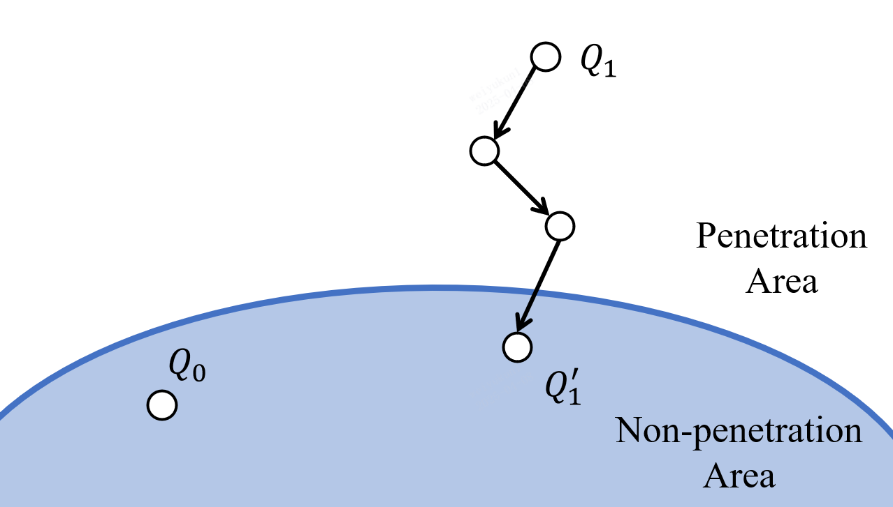
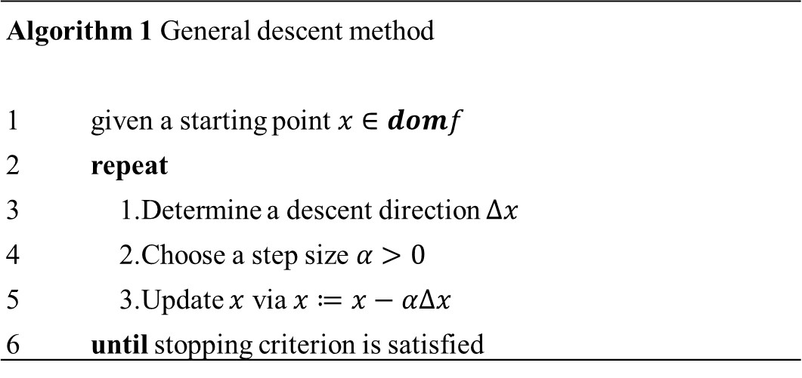
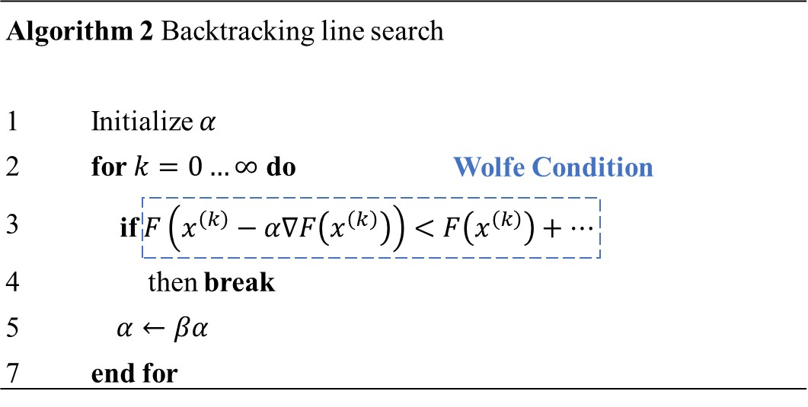
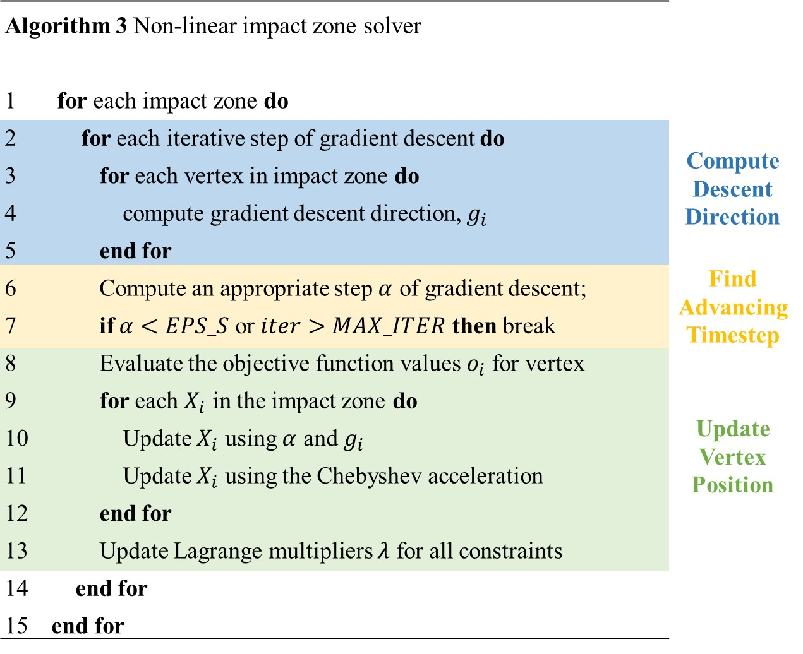
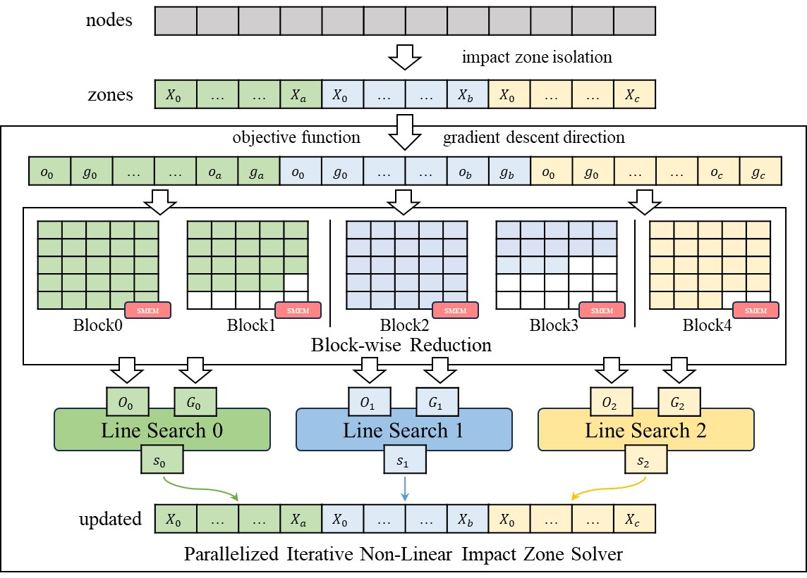

# Impact Zone Optimization

- [Problem Formulation](md-problem-formulation)
- [Constrained to Unconstrained Problem](md-constrained-to-unconstrained-problem)
- [Descent Methods](md-descent-methods)
- [Line Search Method](md-line-search-method)
- [GPU Nonlinear Impact Zone Solver](md-gpu-nonlinear-impact-zone-solver)

(md-problem-formulation)=

## Problem Formulation

Assuming that a mesh is collision-free at $t=0(Q_0)$, it advanced to $ t=1(Q_1) $ through implicit time integration. If collisions happened at $Q_1$, the algorithm aims to compute a new state $Q'_1$, which is collision-free and has a minimum impact on the system energy.

<div style="text-align: center;">
  
</div>

The problem can be formulated as a constrained optimization problem that limits the positions at $Q_1$ and $Q'_1$. The objective function is:

```{math}
\min \left( \frac{\sum_{i=1}^{n}(X_i' - X_i)^2 \cdot m_i}{\sum_{i=1}^{n} m_i} \right) \tag{1}
```

$X_i$ is position at $Q_1$ and $X_i'$ is position at $Q'_1$; $m_i$ is mass of the vertex. Basically, collisions are represented as vertex-face(VF) and edge-edge(EE) collision. The objective function is subject to the following inequality constraints:

```{math}
C_{vf} = N \cdot [X_4 - (\alpha_1 X_1 + \alpha_2 X_2 + \alpha_3 X_3)], \tag{2}
```

```{math}
C_{ee} = N \cdot [(\alpha_3 X_3 + \alpha_4 X_4) - (\alpha_1 X_1 + \alpha_2 X_2)]. \tag{3}
```

where $\alpha1, \alpha2, \alpha3$ represents barycentric coordinates of $F$ in $C_{vf}$; $\alpha1, \alpha2, \alpha3, \alpha4$ represents weights of the nearest points on two edges in $C_{ee}$. We denote equation 1 as $g(X)$ and equation 2,3 as $c^*(X)$. Then, the constrained optimization problem can be formulated as:

```{math}
\min g(X) \quad \text{s.t.} \quad c(X) \leq 0, \tag{4}
```
in which $c(X)=-c^*(X)$. It can be seen that $g(X)$ is subject to $c(X)$.

(md-constrained-to-unconstrained-problem)=

## Constrained to Unconstrained Problem

Solving a constrained problem directly is not simple. We convert the constrained optimization problem to a unconstrained optimization problem utilizing Augmented Lagrangian method.

A constrained optimization problem has the following form:

```{math}
\min f(x) \quad \text{s.t.} \quad g(x) \leq 0$ \tag{5}
```
where $f: \mathbb{R}^n \to \mathbb{R}$ is the objective function in $n$ dimensional space; $g: \mathbb{R}^n \to \mathbb{R}^m$ is vector constraints of size $m$. Equation 5 can be written as:

```{math}
\min f(x) \quad \text{s.t.} \quad \hat{g}(x, s) = 0, \tag{6}
```

where $\hat{g}(x, s) = g(x) + s$ and $s$ is a non-negative relaxation factor. The Augmented Lagrangian method replaces constraints in equation 6 with a combination of Lagrangian multiplier and penalty function:

```{math}
L_A(x, s; \lambda, \mu) = f(x) + \lambda^T \hat{g}(x, s) + \frac{\mu}{2} ||\hat{g}(x, s)||^2. \tag{7}
```

$\lambda \in \mathbb{R}^m, \mu \in \mathbb{R}$ are control parameters. Specifically, $\lambda$ is an evaluation of Lagrangian multiplier. Notice that there are 4 parameters to be optimized, they are $x, s, \lambda, \mu$. The Augmented Lagrangian method updates the parameters via an iterative approach:

- Step1: Fix $\lambda, \mu$, then update $x, s$ by minimizing $L_A$

- Step2: Fix $x, s$, then update $\lambda \leftarrow \lambda + \mu \hat{g}(x, s)$

The $L_A$ got converged when the $\mu$ is large enough. Meanwhile, $\lambda$ will be an approximate of Lagrangian multiplier and $x$ will satisfy the constraints. ArcSim substituted $s$ in equation 7 and simplified the objective as:

```{math}
L_A(x; \lambda, \mu) = f(x) + \frac{\mu}{2} || \tilde{g}(x) ||^2 - \frac{||\lambda||^2}{2 \mu}, \tag{8}
```

Accordingly, the update rules for $\lambda$ is:

```{math}
\lambda \leftarrow \lambda + \mu \hat{g}(x, s) \tag{9}
```

And the penalty function comes to:

```{math}
\tilde{g}(x) = \max(g(x) + \lambda/\mu, 0) \tag{10}
```

Now the constrained optimization problem in equation (5) has been converted to an unconstrained optimization problem. The objective function using Augmented Lagrangian method can be written as:

```{math}
 f(X) = g(X) + \frac{\mu}{2} || \tilde{c}(X) ||^2 - \frac{|| \lambda ||^2}{2 \mu}, \tag{11}
```

To resolve the collisions, we need to minimize $f(X)$. How can we solve this unconstrained optimization problem?

(md-descent-methods)=

## Descent Methods

We can solve the unconstrained optimization problem using gradient descent method, which is one of the most commonly used descent method.

All of the unconstrained optimization algorithms aims to generate a minimized sequence $x^1,x^2,...,x^n$, which updates according to some descent rules. This process can be represented as:

```{math}
x^{(k+1)}=x^{(k)}+\alpha^{(k)}\Delta{x^{(k)}} \tag{12}
```

$\Delta{x^{(k)}}$ is called descent direction; $k$ is iteration count; $\alpha^{(k)} >0$ represents step size of $k$-th iteration. Descent methods satisfy the following condition:

```{math}
f(x^{(k+1)}) < f(x^{(k)}) \tag{13}
```

At each iteration, a descent method moves towards a direction that leads closer to the objective. For convex functions, it holds that
$\nabla f(x^{(k)})^\top \Delta x^{(k)} < 0$, indicating that the descent direction is always opposite to the gradient. In general, a descent method can be formulated as the following process:

<div style="text-align: center;">
  
</div>

The algorithm iteratively updates $x$ using a descent direction $\Delta{x}$ and a step size $\alpha$. Different choices of $\Delta{x}$ lead to different specialized methods, such as Newton’s method, nonlinear conjugate gradient method, etc. When the descent direction is chosen as the negative gradient, i.e., $\Delta x = -\nabla f(x)$, the method reduces to the well-known *gradient descent* algorithm.

(md-line-search-method)=

## Line Search Method

In numerical optimization, there are two fundamental iterative strategies for finding a local minimum of a function, namely *line search* and *trust region* method. Essentially, both approaches aim to determine the strategy of next iterate during the optimization. The primary difference lies in whether the step size or the search direction is determined first. Line search methods first determine the direction and then the step size, which are more widely used in practice.

Generally, line search method is an iterative technique that locates a local minimum utilizing the gradient of a multidimensional nonlinear function. Line search methods are typically categorized into **exact line search** and **inexact line search**. In exact line search, as the name suggests, the goal at each iteration is to find a point that precisely minimizes the objective function $f(x)$ along the search direction. In contrast, inexact line search does not require finding an exact solution. Instead, it suffices to find a step size that satisfies certain conditions (e.g., sufficient reduction in the objective function). The *Wolfe condition* is the commonly used condition in inexact line search.

### Exact Line Search

Exact line search aims to solve the following optimization problem:

```{math}
\alpha^{(k)}=argminF(x^{(k)}-\alpha^{(k)}\nabla{F(x^{(k)}))} \tag{14}
```

This approach, however, introduces a complication. In descent methods, we use exact line search to compute the step size in order to minimize the objective, but performing exact line search itself requires solving another optimization problem. In other words, to solve the original optimization problem, we are first required to solve a secondary optimization problem. As a result, although exact line search often yields faster convergence, it involves high computational cost and increased algorithmic complexity, and is barely used in practice.


### Backtracking Line Search

Given the complexity of exact line search, there is a natural desire for simpler and more computationally efficient search methods. This leads to the introduction of *inexact line search*, among which the most commonly used technique is *Backtracking Line Search*. The overall procedure of the algorithm is as follows:

<div style="text-align: center;">
  
</div>

#### Step Length

When evaluating the step size $\alpha^{(k)}$, we face a trade-off. On one hand, we wish to choose an $\alpha^{(k)}$ that leads to a significant decrease in the objective function $f$. On the other hand, we want to avoid spending excessive time selecting $\alpha^{(k)}$. In simple terms, there is a tension: while evaluating more candidate $\alpha^{(k)}$ values increases the chance of finding one that significantly reduces $f$, it also incurs higher computational cost, thereby affecting efficiency. An ideal choice would be to globally minimize a single-variable function $\phi(\alpha)$, defined as:

```{math}
\phi(\alpha)=f(x^{(k)}+\alpha p^{(k)}) \tag{15}
```

However, finding a global minimum of equation (15) is computationally expensive. In practice, a more feasible approach is to use inexact line search to determine a step size that achieves sufficient decrease in the objective function at minimal cost. A simple condition for selecting $\alpha^{(k)}$ is to require a decrease in $f$, namely $f(x^{(k)} + \alpha^{(k)} p^{(k)}) < f(x^{(k)})$. Nevertheless, this condition alone is not sufficient to guarantee convergence. Therefore, we introduce a more stringent requirement known as the *sufficient decrease condition*.

According to the Taylor expansion:

```{math}
f(x^{(k)}+\alpha^{(k)}p^{(k)}) =f(x^{(k)})+\alpha^{(k)}p^T_k \nabla{f(x^{(k)}+t \alpha^{(k)} p^{(k)})} \tag{16}
```

When moving from $x^{(k)}$ to the next iterate $x^{(k+1)} := x^{(k)} + \alpha^{(k)} p^{(k)}$, we expect that $f$ decreases sufficiently. In other words, the term $\alpha^{(k)} p^T_k \nabla{f(x^{(k)}+t \alpha^{(k)} p^{(k)})}$ in (16) should be sufficiently negative. It is clear that $\alpha^{(k)} p^T_k \nabla{f(x^{(k)}+t \alpha^{(k)} p^{(k)})}$ is proportional to both $\alpha^{(k)}$ and $p^T_k \nabla{f(x^{(k)}+t \alpha^{(k)} p^{(k)})}$. Ideally, we would like $p^T_k \nabla{f(x^{(k)}+t \alpha^{(k)} p^{(k)})}$ to be close to $\nabla{f(x^{(k)}+t \alpha^{(k)} p^{(k)})}$, but this cannot always be guaranteed. Therefore, to relax this assumption, we introduce a small parameter $0 < c_1 < 1$ (typically $c_1=10^{-4}$) and require that:

```{math}
p^T_k \nabla{f(x^{(k)}+t \alpha^{(k)} p^{(k)})} < c_1 p^T_k \nabla{f(x^{(k)})} \tag{17}
```

That is, the decrease in $f$ must be at least a fraction of $p^T_k \nabla{f(x^{(k)})}$.

#### Armijo Condition

Combining (16) and (17), in order for $\alpha^{(k)}$ to ensure a sufficient decrease in $f$, it must satisfy the following inequality:

```{math}
f(x^{(k)}+\alpha p^{(k)}) < f(x^{(k)}) + c_1 \alpha \nabla{f^T_{k}}p^{(k)} \tag{18}
```

This is known as the *Armijo condition*. We define the left-hand side of (18) as $\phi(\alpha) = f(x^{(k)}+\alpha p^{(k)})$, and the right-hand side as $l(\alpha) = f(x^{(k)}) + c_1 \alpha \nabla{f^T_{k}}p^{(k)}$. Based on the comparison between $l(\alpha)$ and $\phi(\alpha)$, the values of $\alpha$ can be categorized into acceptable and unacceptable regions. The sufficient decrease condition states that an $\alpha$ is acceptable if and only if $l(\alpha) \geq \phi(\alpha)$.

#### Curvature Condition

The Armijo condition is relatively simple, to the extent that an arbitrarily small step size $\alpha$ can satisfy the condition. If we only enforce sufficient decrease in $f$, the algorithm may end up taking very small steps at each iteration, which would prevent it from finding the optimal solution efficiently. To eliminate the acceptance of excessively short steps, an additional constraint known as the *curvature condition* is introduced. The reduction in $f$ between $x^{(k)}$ and $x^{(k)}+\alpha p^{(k)}$ is given by:

```{math}
f(x^{(k)}+\alpha p^{(k)}) - f(x^{(k)}) = \alpha p^T_k \nabla{f(x^{(k)}+t \alpha p^{(k)})} \tag{19}
```

If $\alpha$ is small enough, then $p^T_k \nabla{f(x^{(k)}+t\alpha p^{(k)})}$ would be close to $p^T_k \nabla{f(x^{(k)})}$, which is not desirable. Therefore, we introduce two constants $c_1$ and $c_2$ satisfying $c_1 < c_2 < 1$, and require that:

```{math}
p^T_k \nabla{f(x^{(k)}+t\alpha p^{(k)})} > c_2 p^T_k \nabla{f(x^{(k)})} \tag{20}
```

This condition ensures that there is a fixed amount of difference between $p^T_k \nabla{f(x^{(k)}+t\alpha p^{(k)})}$ and $p^T_k \nabla{f(x^{(k)})}$. The requirement as described in (20) is known as the *curvature condition*.

#### Wolfe Condition

By combining the sufficient decrease condition and the curvature condition, we obtain the *Wolfe condition*. Specifically, the two conditions can be written as follows:

```{math}
f(x^{(k)}+\alpha p^{(k)}) < f(x^{(k)}) + c_1 \alpha \nabla{f^T_{k}}p^{(k)} \tag{21a}
```

```{math}
p^T_k \nabla{f(x^{(k)}+t\alpha p^{(k)})} > c_2 p^T_k \nabla{f(x^{(k)})} \tag{21b}
```

The Wolfe condition ensures that the step size $\alpha$ yields sufficient decrease in $f$, while also preventing $\alpha$ from being excessively small.

(md-gpu-nonlinear-impact-zone-solver)=

## GPU Nonlinear Impact Zone Solver

Now we have:

- Transform a constrained optimization problem into an unconstrained one.  

- Solve the unconstrained optimization problem using descent methods.  

- Select the descent direction using gradient descent.  

- Determine the step size using backtracking line search.


Let's revisit the original constrained optimization problem:

```{math}
\min g(X) \quad \text{s.t.} \quad c(X) \leq 0
```


We convert this problem into an unconstrained optimization problem using the augmented Lagrangian method:

```{math}
f(X) = g(X) + \frac{\mu}{2} || \tilde{c}(X) ||^2 - \frac{|| \lambda ||^2}{2 \mu}
```

Then, we use gradient descent as the descent direction, and determine the step size using backtracking line search, until the Wolfe condition is satisfied:

```{math}
f(X^{(k)} - s^{(k)} \cdot \Delta{X^{(k)}}) < f(X^{(k)}) - \alpha \cdot s^{(k)} \cdot ||\Delta{X^{(k)}}||^2
```

The overall algorithm is illustrated in the figure below:

<div style="text-align: center;">
  
</div>

The algorithm generally follows the update scheme of a descent method, and can be broken down into three steps:

1. Compute the descent direction

2. Find an appropriate step size

3. Update the vertex position

If the algorithm (3) is implemented on the CPU, the procedure is straightforward: we group the nodes involved in the impact and obtain independent impact zones, then apply the descent method to optimize the objective function. However, the efficiency on the CPU is limited, the impact zones are processed sequentially. As described in I-Cloth, we adopt a GPU implementation to resolve each impact zone as an unconstrained optimization subproblem:

<div style="text-align: center;">
  
</div>

## References

[1]: <span name = "ref19">Narain R, Samii A, O'brien J F. Adaptive anisotropic remeshing for cloth simulation[J]. ACM transactions on graphics (TOG), 2012, 31(6): 1-10.</span>

[2]: <span name = "ref21">Nocedal J, Wright S. Numerical Optimization[M]. Springer Science & Business Media, 2006.</span>

[3]: <span name = "ref20">Tang M, Wang T, Liu Z, et al. I-Cloth: Incremental collision handling for GPU-based interactive cloth simulation[J]. ACM Transactions on Graphics (TOG), 2018, 37(6): 1-10.</span>